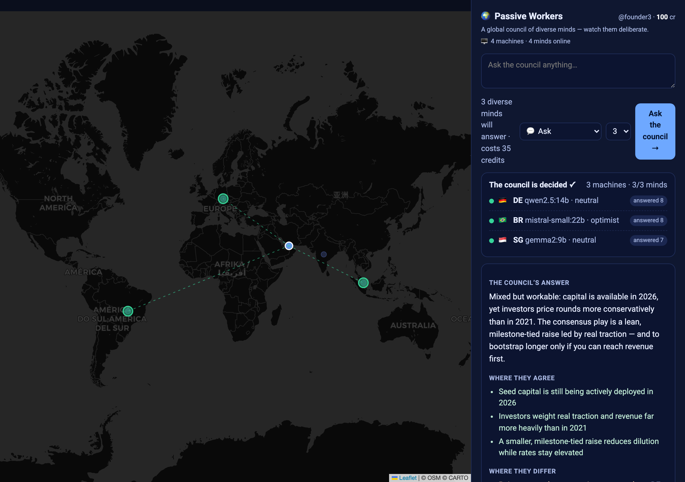
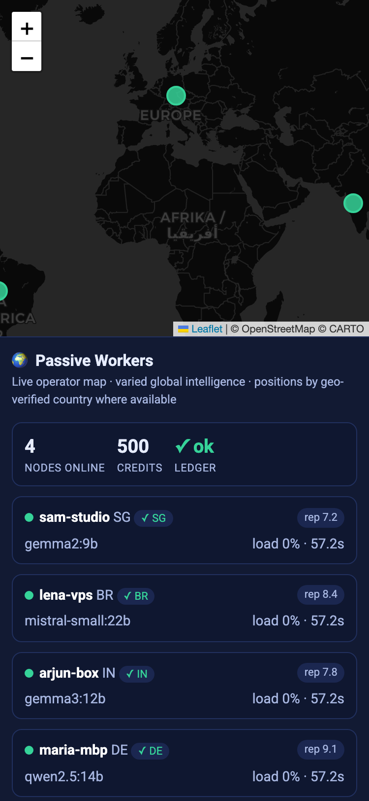

# Is Passive Workers actually beneficial? — measured, on real hardware

This is an honest evidence report, run on **2026-06-14** against the **real engine** on local Ollama
(`qwen2.5:14b`, `mistral-small:22b`, `gemma3:12b`, `gemma2:9b`). It is not "the tests pass" — it's the
software doing its job and being scored. Where the evidence is thin, that's said plainly.

## Bottom line
**Yes — for what it actually claims to be**, and not beyond that:
- On **time-sensitive questions**, the local council with live web **beats a frontier model
  (`gpt-5-chat`) answering from memory** — measured head-to-head. That is the core promise.
- On **stable knowledge**, they **tie** — so this is *not* a "we beat frontier models" tool, and it
  doesn't pretend to be. The honest edge is **currency, privacy, grounding, and cost**, not raw IQ.
- Its citations are **actually grounded in their sources**, not decorative.

So it is genuinely beneficial for: people who **can't or won't** send their data to a cloud, who need
**current** answers a frozen chatbot gets wrong, who have **no API budget**, or who want **re-checkable
citations** — and (opt-in) a commons of computers doing that work for each other.

---

## The evidence

### 1. Currency moat — council (live web) vs frontier (memory), head-to-head
`scripts/eval_currency_gap.py --run` · frontier = `openai/gpt-5-chat` (paid baseline, no web by
design) · local blind grader · 10 questions · scored 0–10 vs curated references.

| window (currency) | council, live web | frontier, memory | gap |
|---|---|---|---|
| **static** (fairness control) | 10.00 | 10.00 | **+0.00** — tie, as it should be |
| **recent** | 5.00 | 2.50 | **+2.50** |
| **breaking** | 4.00 | 1.00 | +3.00 ⚠ (n=2) |
| **overall** | 6.80 | 5.20 | **+1.60** |

**Read it honestly:** the **static tie is the point** — when currency doesn't matter, a local 14–22B
council does *not* out-think a frontier model. The benefit appears exactly where it's claimed: on
**recent** (+2.50) and **breaking** (+3.00) questions, live grounding wins. The frontier answers
without web *by design* — this measures the value of live grounding, not model weakness.
*Caveats: small samples (recent n=4, breaking n=2 ⚠ — noise at that size), an LLM grader, one curated
reference per question, and quick-depth council. It's a real signal, not a universal verdict.*

### 2. Citations are grounded, not decorative
`scripts/eval_citation_fidelity.py` on a fresh report ("current US federal funds rate…"):
- **Grounded rate: 5/5 verifiable cited claims (100%)**, **mean content overlap 86%**.
- 3 claims unverifiable on live re-fetch (page drift/paywall) — reported separately, never as failures.
- Honest framing the tool itself prints: *grounded = "not obviously fabricated", not "verified true."*
  It's a floor against the common, damaging failure (off-topic/fabricated citations) — and it holds.

### 3. The actual output is good
A real `pw research` run (quick, 2 analysts, **2.7 min, 16 sources**) produced a report that is
**current** (June-2026-dated sources lead), **cited** (`[S#]` with real URLs + dates), and — notably —
**preserves disagreement**: the two analysts differed on the next FOMC date and the report *says so*
rather than faking a consensus. Full sample: [`sample-report.md`](sample-report.md).

### 4. Private-document retrieval works
`scripts/bench_rag.py`: **recall@1 = 7/7** (both dense and hybrid BM25⊕RRF). The corpus is small and a
strong local embedder saturates it (honest caveat) — hybrid is robustness insurance for the long tail.
The benefit that matters: documents are embedded **locally** (`nomic-embed-text`) and never uploaded.

### 5. The "council" (multi-model) value — honestly bounded
`scripts/merge_eval.py` does a **length-controlled, position-swapped** comparison (so a longer answer
can't win just by being longer). A **fresh run today** (3 questions): **raw win-rate 1/3, but
length-controlled win-rate 2/3** — i.e. the merge beats the best single answer even after removing the
verbosity advantage. That's the honest shape: the diversity dividend is real **per word** but small
(n=3) — the council's value is dissent-preservation + currency, not a large raw-quality jump. It does
*not* inflate the win by being longer (the merge was consistently ~half the length of the best single).

---

## What this is NOT (the honest limits)
- **Not a frontier-beater on stable knowledge** — the static tie proves it; don't use it for math/code/
  explanations where a frontier chatbot is better.
- **Small samples** in the currency eval — directional, not a benchmark league table.
- **The network is the maturing track.** The multi-node map, geo-verified badges, and leaderboard in
  the screenshots below are driven by **seeded demo data** (clearly labeled) — the *single-player*
  engine is the verified flagship; the federation is real code but early/invite-only.

## See it (screenshots of the real running app)
Desktop + mobile, captured with Playwright against the live UIs. (The research desk shows a **real**
generated report; the marketplace council answer is an **illustrative** seeded example.)

| Surface | Desktop | Mobile |
|---|---|---|
| Research desk (real report) |  |  |
| Marketplace (council answer) |  |  |
| Operator dashboard (geo + leaderboard) |  |  |

## Reproduce it yourself (keyless unless noted)
```bash
pw research "What is the current US federal funds rate target range?" --quick --analysts 2
python scripts/eval_citation_fidelity.py --report reports/<that-report>.md
python scripts/bench_rag.py
python scripts/merge_eval.py
python scripts/eval_currency_gap.py            # $0 dry run (validate + estimate)
OPENROUTER_API_KEY=… python scripts/eval_currency_gap.py --run   # paid frontier baseline (~$0.10)
```
