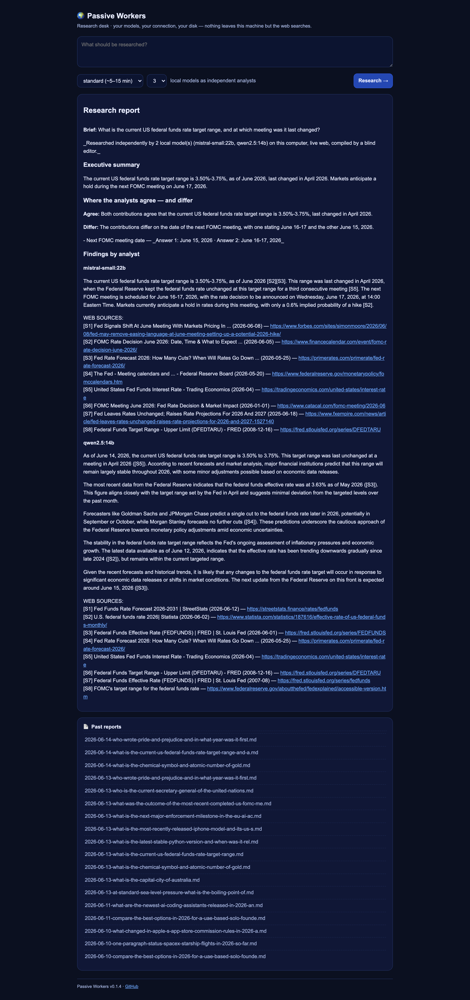
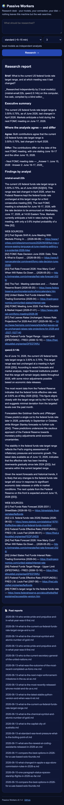
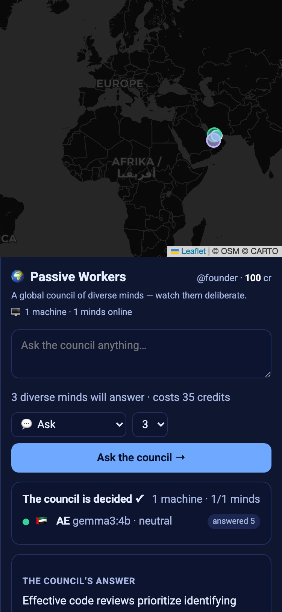
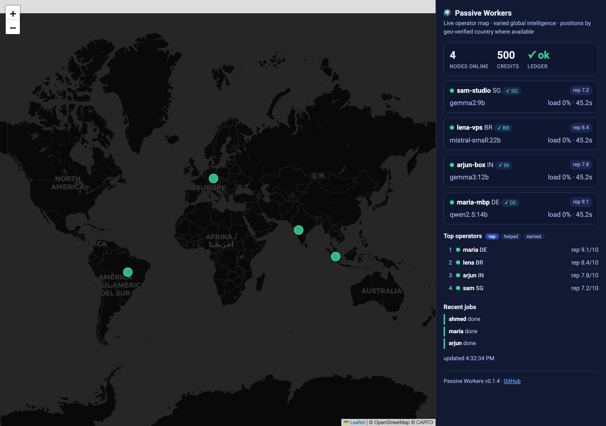

# Is Passive Workers actually beneficial? — measured, on real hardware

This is an honest evidence report, run on **2026-06-14** against the **real engine** on local Ollama
(`qwen2.5:14b`, `mistral-small:22b`, `gemma3:12b`, `gemma2:9b`). It is not "the tests pass" — it's the
software doing its job and being scored. Where the evidence is thin, that's said plainly.

## Bottom line
**Yes — for what it actually claims to be**, and not beyond that:
- On **time-sensitive questions**, the local council with live web **beats a frontier model
  (`gpt-5-chat`) answering from memory** — measured head-to-head. That is the core promise.
- On **stable knowledge**, they **tie** — so this is *not* a "we beat frontier models" tool, and it
  doesn't pretend to be. The honest edge is **currency, privacy, grounding, and cost**, not raw IQ.
- Its citations are **actually grounded in their sources**, not decorative.

So it is genuinely beneficial for: people who **can't or won't** send their data to a cloud, who need
**current** answers a frozen chatbot gets wrong, who have **no API budget**, or who want **re-checkable
citations** — and (opt-in) a commons of computers doing that work for each other.

---

## The evidence

### 1. Currency moat — council (live web) vs frontier (memory), head-to-head
`scripts/eval_currency_gap.py --run` · frontier = `openai/gpt-5-chat` (paid baseline, no web by
design) · local blind grader · 10 questions · scored 0–10 vs curated references.

| window (currency) | council, live web | frontier, memory | gap |
|---|---|---|---|
| **static** (fairness control) | 10.00 | 10.00 | **+0.00** — tie, as it should be |
| **recent** | 5.00 | 2.50 | **+2.50** |
| **breaking** | 4.00 | 1.00 | +3.00 ⚠ (n=2) |
| **overall** | 6.80 | 5.20 | **+1.60** |

**Read it honestly:** the **static tie is the point** — when currency doesn't matter, a local 14–22B
council does *not* out-think a frontier model. The benefit appears exactly where it's claimed: on
**recent** (+2.50) and **breaking** (+3.00) questions, live grounding wins. The frontier answers
without web *by design* — this measures the value of live grounding, not model weakness.
*Caveats: small samples (recent n=4, breaking n=2 ⚠ — noise at that size), an LLM grader, one curated
reference per question, and quick-depth passiveworkers. It's a real signal, not a universal verdict.*

> **Replication at deeper depth (2026-06-14, same 10 verified questions, `--depth standard --analysts 2`):**
> static **−0.25** (9.75 vs 10.00, control still ~tie), recent **+2.25** (5.00 vs 2.75), breaking
> **+2.00 ⚠** (2.00 vs 0.00, n=2), overall **+1.20** (6.30 vs 5.10). The moat **replicates** — the
> council wins on recent/breaking and ~ties on the control at both depths. Notably, deeper depth did
> **not** raise the overall score (6.30 vs 6.80 at quick) — honest signal that the edge is **currency
> (live web), not compute depth**. We re-ran the *verified* question bank deeper rather than fabricate
> new "breaking" reference answers we couldn't vouch for (a wrong reference silently corrupts the gap).

### 2. Citations are grounded, not decorative
`scripts/eval_citation_fidelity.py` on a fresh report ("current US federal funds rate…"):
- **Grounded rate: 5/5 verifiable cited claims (100%)**, **mean content overlap 86%**.
- 3 claims unverifiable on live re-fetch (page drift/paywall) — reported separately, never as failures.
- Honest framing the tool itself prints: *grounded = "not obviously fabricated", not "verified true."*
  It's a floor against the common, damaging failure (off-topic/fabricated citations) — and it holds.

### 3. The actual output is good
A real `pworkers research` run (quick, 2 analysts, **2.7 min, 16 sources**) produced a report that is
**current** (June-2026-dated sources lead), **cited** (`[S#]` with real URLs + dates), and — notably —
**preserves disagreement**: the two analysts differed on the next FOMC date and the report *says so*
rather than faking a consensus. Full sample: [`preview/sample-report.md`](preview/sample-report.md).

### 4. Private-document retrieval works
`scripts/bench_rag.py`: **recall@1 = 7/7** (both dense and hybrid BM25⊕RRF). The corpus is small and a
strong local embedder saturates it (honest caveat) — hybrid is robustness insurance for the long tail.
The benefit that matters: documents are embedded **locally** (`nomic-embed-text`) and never uploaded.

### 5. The "council" (multi-model) value — honestly bounded
`scripts/merge_eval.py` does a **length-controlled, position-swapped** comparison (so a longer answer
can't win just by being longer). A **fresh run today** (3 questions): **raw win-rate 1/3, but
length-controlled win-rate 2/3** — i.e. the merge beats the best single answer even after removing the
verbosity advantage. That's the honest shape: the diversity dividend is real **per word** but small
(n=3) — the council's value is dissent-preservation + currency, not a large raw-quality jump. It does
*not* inflate the win by being longer (the merge was consistently ~half the length of the best single).

---

## What this is NOT (the honest limits)
- **Not a frontier-beater on stable knowledge** — the static tie proves it; don't use it for math/code/
  explanations where a frontier chatbot is better.
- **Small samples** in the currency eval — directional, not a benchmark league table.
- **The network is the maturing track.** The screenshots below are a **real but small** deployment:
  a brand-new operator joined with `pworkers join` and answered one real job (it even shows up on the
  leaderboard as `mac AE`, rep 5/10). It's genuine, not seeded — but it's *one* node; the map and
  leaderboard fill out only as real operators join (still invite-only). The single-player engine is
  the verified flagship; the federation is real, working code that's early.

## Validated by dogfooding on a real VPS (2026-06-14)
We ran the **actual operator onboarding on a Hetzner VPS** (Ubuntu, a machine we don't develop on):
`pip install passiveworkers` (7s) → `pworkers join` registered the node and wrote `~/.passiveworkers/join.json`
**owner-only (0600)**. This surfaced — and we fixed — **two real bugs that made `pworkers join` unusable**:
(1) enrolled nodes were rejected on every authenticated call because those endpoints also demanded the
shared admin token a `pworkers join` operator never has (now the per-node secret authenticates on its own);
(2) a lone operator defaulted to *not* judging, so jobs failed "no judge node online" (judging is now
on by default). After the fixes, the full loop completes end-to-end (answer → judge → cited result) —
verified locally with a real `done` job; on the VPS it reached the judge stage but hit the 600s deadline
purely because that box was at load ~20 (other workloads), not a code issue.

## See it (screenshots of the real running app)
Desktop + mobile, captured with Playwright against the live UIs — **all real** (a real generated
report; a real answered job; a real single-node operator dashboard).

| Surface | Desktop | Mobile |
|---|---|---|
| Research desk (real report) |  |  |
| Marketplace (council answer) |  |  |
| Operator dashboard (geo + leaderboard) |  |  |

## Reproduce it yourself (keyless unless noted)
```bash
pworkers research "What is the current US federal funds rate target range?" --quick --analysts 2
python scripts/eval_citation_fidelity.py --report reports/<that-report>.md
python scripts/bench_rag.py
python scripts/merge_eval.py
python scripts/eval_currency_gap.py                          # $0 dry run (validate + estimate)
python scripts/eval_currency_gap.py --run --baseline local   # $0 — council vs the SAME local models from memory
python scripts/eval_citation_fidelity.py --compare           # $0 — self-repair OFF vs ON, grounded-rate delta
OPENROUTER_API_KEY=… python scripts/eval_currency_gap.py --run --baseline frontier   # paid frontier baseline (~$0.10)
```

---

## Appendix — 2026-07-10 (R35): trustworthier reports + a free currency read
This appendix **adds to** the numbers above; it does not retract them. Two changes landed as 0.3.0, both
measured on local Ollama with just `gemma3:4b` and `gemma3:12b` (a modest 2-model rig, so these are floor
readings, not a ceiling — a real deployment with a 14–32B analyst would show more).

**1. Citation self-repair now runs at inference time.** The grounding check that used to run only as an
offline eval now runs *inside* `pworkers research`: an analyst's cited claims are scored against the exact
sources the model saw, and unsupported/fabricated-number claims trigger one bounded re-prompt to correct
or drop them — **accepted only if that measurably reduces the unsupported set without losing grounded
content, so it can never lower a report's grounding by its own measure.** We measure it with a *paired*
A/B (`eval_citation_fidelity.py --paired`): score the SAME draft pre- and post-repair against the SAME
evidence, so there is no re-research variance. On this 2-model rig the honest picture is:

- With a capable analyst (`gemma3:12b`), the pass fires on the drafts that carry a fixable unsupported
  claim and removes them with **zero regression** — an illustrative 4-question run improved the grounded
  rate **85% → 88%** (2 of 4 drafts repaired).
- With the weak `gemma3:4b` analyst, it **safely declined every revision** (the model would have kept the
  wrong number while dropping its citation — *hiding* the fabrication rather than fixing it — which the
  gate refuses), so it made no change.

So the effect size is small and noisy on a small local rig (0 to +3 pts across runs) — but it is **never
negative**, and its corrective value scales with the analyst model. The guarantee is the point, not a big
number. (A naive *between-runs* `--compare` gave a misleading −16 pts here, which is pure run-to-run
variance at this sample size — exactly why the paired instrument exists.) An adversarial review of this
feature caught a real gate-evasion — a model stripping a citation to *hide* a claim rather than fix it —
now blocked; see D51.

**2. The currency edge, now measurable for `$0`.** The head-to-head no longer requires a paid frontier
model: `--baseline local` pits the council (local models + live web) against **the same local models
answering from their own frozen memory** — exactly what the claim says, at no cost and with no API key.
On a bank re-verified from the live web on 2026-07-10 (4 static / 7 recent / 5 breaking):

```
  window       n  paired   council  baseline    gap
  static       4     4       9.00      9.50    -0.50    ← fairness control (currency irrelevant): ≈ tie
  recent       7     7       5.71      1.14    +4.57
  breaking     5     5       4.80      0.80    +4.00
  OVERALL     16    16       6.25      3.12    +3.12
  council = gemma3:4b + live web · baseline = gemma3:4b from memory · grader = gemma3:12b vs curated refs · $0
```

The shape is exactly what an honest currency eval should show: on **static** facts the memory baseline
essentially ties the council (indeed edges it, −0.5 — so the eval is not tilted toward us), while on
**recent** (+4.6, n=7) and **breaking** (+4.0, n=5) the live-web council pulls decisively ahead. Both
moving windows clear the "paired n < 3 = noise" floor. This is the same model on both sides — the only
difference is live grounding — and it cost nothing.

Read the gap, not the columns: it is the paired (council − baseline) mean, and both sides are graded by
the same local judge against a curated reference, so grader quirks cancel. Expect ≈0 on *static* (the
fairness control — currency is irrelevant there) and positive on *recent/breaking* if the moat is real.
The paid frontier comparison from the original report still stands and remains available as
`--baseline frontier`.

---

## Appendix — 2026-07-10 (R36): rerank + adaptive depth, on a bigger local analyst
0.4.0 added two flagship-quality levers, both **safe by construction** — a web-evidence **rerank** (it only
reorders sources toward relevance; identity order on any failure, so it can never drop a source) and
**adaptive/recursive depth** (a budgeted loop that adds evidence and stops early when saturated). Measured
on `gemma3:12b` (a step up from the 2-model `gemma3:4b` rig above); the citation-fidelity numbers are a
*between-runs* A/B, so run-to-run variance is real at this sample size — read them as directional.

**Rerank A/B** — three *non-temporal* briefs (RSA, photosynthesis, the seasons; rerank only engages when a
brief isn't time-sensitive), `pworkers research --depth standard`, citation self-repair held OFF to isolate the
rerank, grounded-rate scored against the exact evidence each analyst read:

```
  rerank OFF : 23/26 grounded (88%) · mean source-overlap 68%
  rerank ON  : 21/24 grounded (88%) · mean source-overlap 71%
  gemma3:12b · --depth standard · 3 non-temporal briefs · self-repair held OFF to isolate the rerank
```

Grounded rate is flat (88% both arms — inside the between-runs noise at 24–26 claims); mean source-overlap
edges up 68% → 71% (the reranked evidence is a bit more on-topic to what gets cited). Directional, not a
headline — but it never went the wrong way, which is what "safe by construction" should look like.

**No regression to the currency edge** — with *all* levers on (rerank + adaptive depth + the R35 citation
critic), the free currency gap still holds (`gemma3:4b`, `--depth standard`, static + recent windows):

```
  window     n  paired   council  baseline    gap
  static     4     4       9.75      9.50    +0.25    ← fairness control still ≈ tie (the levers didn't tilt it)
  recent     4     3       5.67      2.00    +3.00    ← the currency edge holds with all levers ON
  gemma3:4b + live web  vs  the same model from memory · grader gemma3:12b · $0
```

Honest bottom line: the levers are designed so they cannot lower research quality (rerank reorders; deeper
search only adds evidence), and they leave the currency edge intact. A clean *magnitude* on a small local
rig is hard to isolate — between-runs variance dominates, exactly as the R35 self-repair appendix found —
so the case rests on the mechanism (best sources into the cap + read in full; more coverage on hard briefs)
and the unit tests that pin the permutation and budget guarantees, not on a single headline number.
